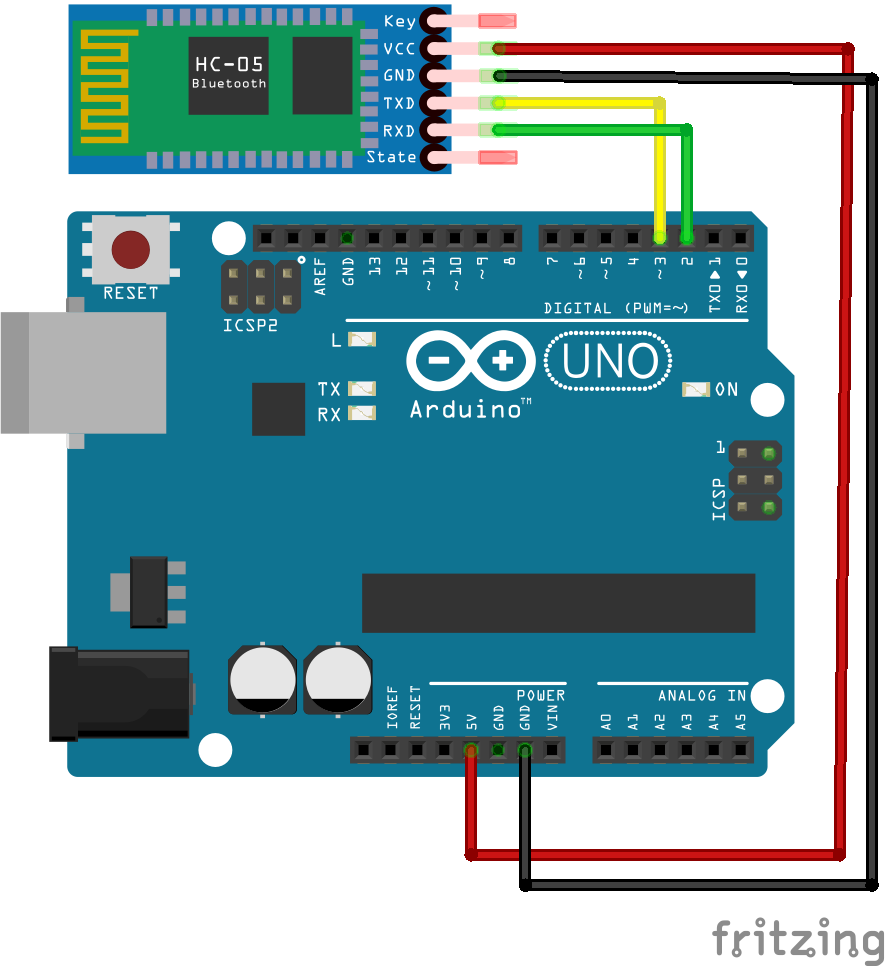

# Week 12

## Bluetooth

+ The Arduino and the bluetooth module need to talk to one another, so the Tx (transmit) pin on the bluetooth module goes to the Rx (receive) pin on the Arduino (which is specified in code) and vice versa. This is referred to as "crossover" wiring.

+ Bluetooth communication works just like Serial, but it happens wirelessly. You also need to add the SoftwareSerial library in order to create a second Serial channel. 

+ Bonus idiosyncracies explained [here](http://www.instructables.com/id/AT-command-mode-of-HC-05-Bluetooth-module/)

## Exercise: Bluetooth Robot Arm

+ Use the demo code from this week to set up wireless bluetooth control of your robot arm. You will need to work in groups of 2 or 3 because we have a limited number of bluetooth modules.

+ You'll need to create a custom interface in Processing that sends commands to the Arduino, which will then actuate the servo motors. This is intentionally an open-ended exercise; the way you decide to have the robot arm respond to commands, and have the Processing sketch issue commands, is up to you.

## Homework

+ Come up with three physical computing projects. At least two should feature the robot arm. Write a short description of the project and what you would need to technically achieve it.
	+ Example: I would like to create a "prank call bot" that used the robot arm to dial random phone numbers on a telephone. It would then play an audio clip or speak a generative robot voice if someone picked up. I would need to figure out how to make the robot arm accurately press the phone number buttons, and to figure out how to know whether or not someone picked up the phone.
+ These should be written in a text file called "final_proposals.md" and uploaded to your repos.